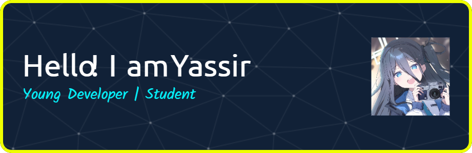

# 💫 About Me:
-🔭 I’m currently working on personal website portfolio and some front-end projects - 🌱 I’m currently learning Vue.js & Tailwind CSS to build better UI - 👯 I’m looking to collaborate on beginner-friendly open source projects or coding events - 🤔 I’m looking for help with improving my JavaScript and Vue component structure - 💬 Ask me about HTML, CSS, responsive design, or how to survive debugging 😅 - 📫 How to reach me: kingsirrperbedaan@gmail.com / Instagram @yassir_id1945 / LinkedIn..... - 😄 Pronouns: he/him - ⚡ Fun fact: I code better with indie music and iced coffee ☕🎧

## 🌐 Socials:
    

# 💻 Tech Stack:
                        
# 📊 GitHub Stats:
 
 

## 🏆 GitHub Trophies

### ✍️ Random Dev Quote

### 🔝 Top Contributed Repo

---

### 🎵Last Music Played

<picture>
  <source media="(prefers-color-scheme: dark)" srcset="https://raw.githubusercontent.com/YassirID/YassirID/output/pacman-contribution-graph-dark.svg">
  <source media="(prefers-color-scheme: light)" srcset="https://raw.githubusercontent.com/YassirID/YassirID/output/pacman-contribution-graph.svg">
  
</picture>

###

###

### ❤️My Waifu

  
  

  

  
  
  
  
  

  

###

<!-- Proudly created with GPRM ( https://gprm.itsvg.in ) -->

<!--
**YassirID/YassirID** is a ✨ _special_ ✨ repository because its `README.md` (this file) appears on your GitHub profile.

Here are some ideas to get you started:

-->
<!-- 
### 👋 Hi there! I'm Yassir

#### Skills

#### Connect with me

    

#### My Github Stats
 -->
